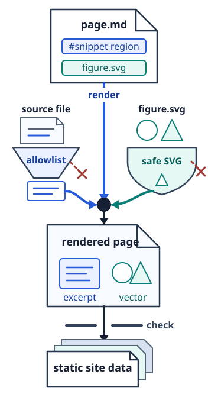

# Authoring extensions

The extensions remain readable in their source form and are validated during
the documentation build. Raw HTML is disabled. Links must be local or use an
allowed HTTP(S) or email scheme, and images must name a validated local SVG
figure bundle.

## Tabs {#tabs}

Use tabs when several representations explain the same idea. Each pane begins
with `==` followed by its label.

:::tabs
== Request

```json
{
  "name": "Ada"
}
```

== Response

```json
{
  "message": "Hello, Ada."
}
```
:::

## Snippets {#snippets}

A snippet fence lifts one named region from an allowed source file. The sample
below is backed by the code in `examples/source`, rather than a second copy in
this page. Its target is relative to the space's configured `sourceRoot`, which
is the repository root for this sample.

```snippet examples/source/GreetingFormatter.cs#greeting-format
title: Format a greeting
lang: csharp
```

The extracted method rejects a blank name, trims surrounding whitespace, and
returns the formatted greeting. The fence keeps this explanation tied to the
compiled example instead of maintaining a second implementation in Markdown.

Markers use whole-line comments in the source:

```text
// docs:begin region-name
// lines included in the documentation
// docs:end region-name
```

The gate rejects missing files, missing markers, duplicate markers, and source
paths outside the configured publication boundary.

## Figures {#figures}

A figure bundle at `_assets/figures/<name>/` keeps an intent ledger, an editable
source, a deterministic `build.py`, a review wrapper, and the canonical
`figure.svg`. The documentation renderer consumes only the SVG. Refer to it
with ordinary image syntax so the source remains useful in a basic Markdown
viewer.



Run `python -B docs/_assets/figures/document-flow/build.py` from the repository
root to rebuild this sample's SVG and `figure.html`. Figure SVG must be
self-contained. Scripts, event-handler attributes, embedded HTML, and external
references are rejected.

## Plans {#plans}

A titled Plan separates intended behavior from the available implementation.
Each H3 goal uses a durable explicit anchor with the prefix configured by the
documentation audit. Navigation derives its Plan count from the containers, so
authors do not maintain a separate status registry.

:::plan Publish translated documentation

### Publish a parallel language space {#plan-docs-publish-translated-space}

**Current:** The sample publishes one documentation space in one language.

- [ ] Add a second documentation space with an explicit route and navigation.
- [ ] Verify that equivalent cross-space links retain their durable fragments.

**Done when:** A checked render publishes both spaces and reports no broken
routes or heading anchors.
:::

## References

- **Source:** [Complete greeting formatter source](/code/examples/source/GreetingFormatter.cs)
